 

---

## About Me

<table>
<tr>
<td width="62%" valign="top">

저는 **Lava Labs**를 운영하며 아이디어를 실제로 사용할 수 있는 웹 서비스와 운영 도구로 구현하고 있습니다.

개발, 디자인, 운영을 분리하지 않고 **사용자 경험·업무 효율·브랜드 표현**을 하나의 제품 관점에서 함께 설계합니다. 사진 작업에서는 일상과 공간, 사람의 분위기를 자연스럽게 기록합니다.

- **Product & Web** — 웹사이트, 업무 도구, 자동화 서비스
- **Business Systems** — 운영 프로세스, 매뉴얼, 고객 접점 개선
- **Creative Work** — 사진, 콘텐츠, 브랜드 비주얼
- **Current Focus** — AI 활용 개발, 소규모 SaaS, 서비스 자동화

</td>
<td width="38%" valign="top" align="center">

</td>
</tr>
</table>

---

## Selected Projects

<table>
<tr>
<td width="50%" valign="top">

###  Lava Labs

아이디어를 실제 서비스로 구현하는 디지털 스튜디오입니다. 웹 개발, 자동화, 콘텐츠와 실험적인 제품을 운영합니다.

</td>
<td width="50%" valign="top">

### 📷 365 Daily Snap

일상, 인물, 공간의 분위기를 기록하는 사진 프로젝트입니다. 촬영 결과물과 브랜드 경험을 웹으로 연결합니다.

</td>
</tr>
<tr>
<td width="50%" valign="top">

### 🔍 Follow Checker

소셜 계정의 팔로우 관계를 편리하게 확인하고 관리하기 위한 분석 도구입니다.

</td>
<td width="50%" valign="top">

### 💙 Shape of Heart

감정과 관계를 디지털 경험으로 표현하는 인터랙티브 웹 프로젝트입니다.

</td>
</tr>
<tr>
<td colspan="2" valign="top" align="center">

### ⏱️ TimeFit

시간과 일정 정보를 더 직관적으로 다루기 위한 생산성 프로젝트입니다.

</td>
</tr>
</table>

---

## Tech Stack

### Build

### Platform & Data

### Creative

---

## Activity

---

## Working Principles

### **Useful first. Beautiful by design. Sustainable in operation.**

서비스는 실제로 쓸 수 있어야 하고, 디자인은 목적을 분명하게 전달해야 하며, 운영은 오래 유지할 수 있어야 한다고 생각합니다.

 

### Let’s build something useful.

새로운 웹 프로젝트, 자동화, 사진 및 콘텐츠 협업에 열려 있습니다.

  

